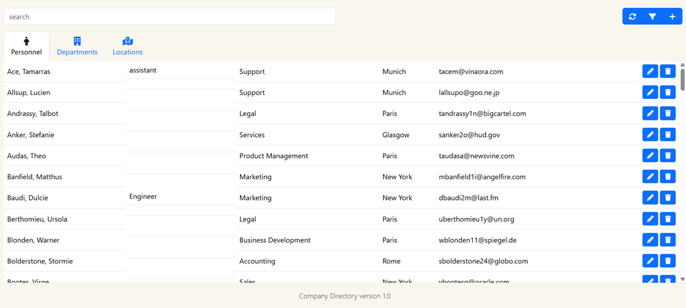
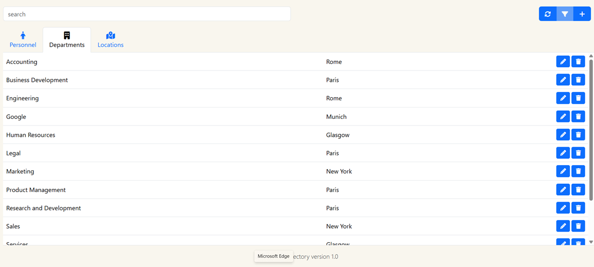
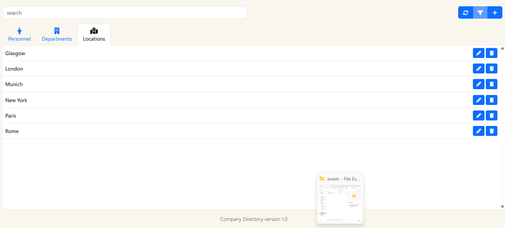
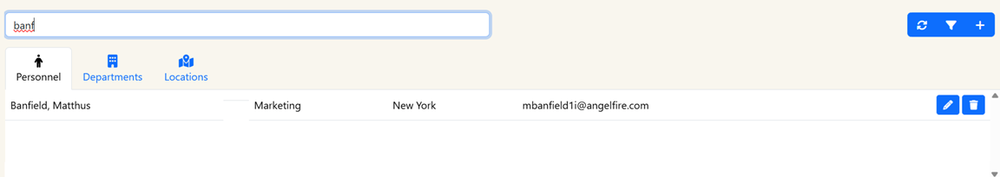

# company_directory_system
A multi‑tab Python GUI application with full CRUD operations for managing Personnel, Departments, and Locations.

**Company Directory (Python GUI – Multi‑Tab CRUD System)**

A multi‑tab Python application for managing Personnel, Departments, and Locations, each with full CRUD functionality.
Built with a clean, user‑friendly interface, the system includes search, filtering, live previews, and persistent data storage — making it a practical demonstration of structured application design.
🔗 Live Demo: https://jimsloss.co.uk/projects/companydirectory/

✨ Features

Three Dedicated Management Tabs
- 👤 Personnel
- 🏢 Departments
- 📍 Locations
Each tab includes:
- ➕ Create new records
- 📄 Read and view existing entries
- ✏️ Update selected items
- ❌ Delete records
- 🔍 Search bar for instant filtering
- 🔄 Refresh button to reload data
- 🎛️ Filter options for quick narrowing
- 👁️ Live preview panel showing selected record details

🖥️ User Interface Overview
The application is designed around clarity and workflow efficiency:
- Tabbed layout keeps each dataset organised
- Consistent CRUD controls across all sections
- Real‑time search updates results as you type
- Preview panel shows details before editing or deleting
- Responsive layout for smooth navigation

🧩 How It Works
Each tab interacts with its own dataset, following the same structured pattern:
- Load data from storage
- Display in a list/table
- Allow search and filtering
- Provide CRUD operations
- Update the preview panel
- Save changes back to storage
This mirrors real‑world admin systems and demonstrates scalable design.

🛠️ Installation & Running
Clone the repository
git clone https://github.com/jimsloss/company-directory.git
cd company-directory

Run the application
python main.py

No external dependencies required — the project runs on standard Python.

🧱 Project Structure
/src
    main.py
    personnel.py
    departments.py
    locations.py
    storage.py
/assets
    screenshots...
/data
    personnel.json
    departments.json
    locations.json
README.md

- main.py – Application entry point and UI layout
- personnel.py / departments.py / locations.py – CRUD logic for each tab
- storage.py – Handles loading and saving data
- data folder – Persistent storage for all records

## 🖼️ Screenshots

### Personnel Tab

### Departments Tab

### Locations Tab

### Search, Filter & Live Preview

📚 What I Learned
This project strengthened my skills in:
- Multi‑module Python application design
- GUI development with structured workflows
- CRUD architecture across multiple datasets
- Designing consistent UI patterns
- Data persistence and file handling
- Search, filtering, and live preview logic
- Building scalable, maintainable codebases
It also reinforced the importance of user‑centred design and predictable interactions.

🔮 Future Improvements
- Export to CSV
- Role‑based access control
- Sorting options
- Dark mode
- Database backend (SQLite)
- Improved validation and error messaging

📄 License
MIT License — free to use, modify, and share.
